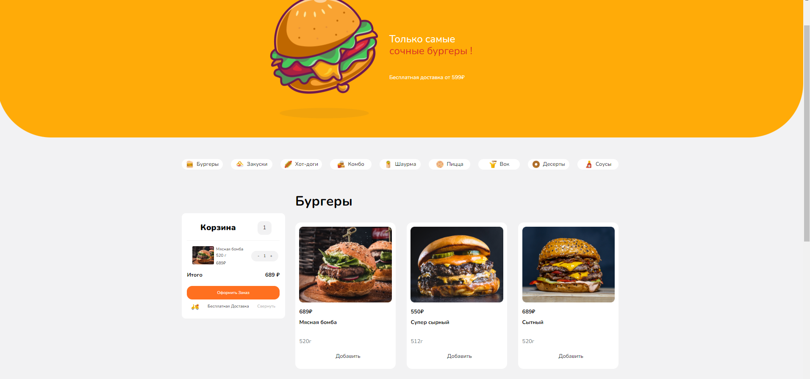

# Meals
<a href="https://mike14112.github.io/Meals/" style='color:white; cursor:pointer;'> This Page link </a>



   <h2> The technologies I used 🚀 :</h2>
  <br>
<h3 style='display:flex; justify-content:space-around; aling-items:center; gap:20px; '>


<svg> <path fill-rule="evenodd" clip-rule="evenodd" d="M25.517 0C18.712 0 14.46 3.382 12.758 10.146c2.552-3.382 5.529-4.65 8.931-3.805 1.941.482 3.329 1.882 4.864 3.432 2.502 2.524 5.398 5.445 11.722 5.445 6.804 0 11.057-3.382 12.758-10.145-2.551 3.382-5.528 4.65-8.93 3.804-1.942-.482-3.33-1.882-4.865-3.431C34.736 2.92 31.841 0 25.517 0zM12.758 15.218C5.954 15.218 1.701 18.6 0 25.364c2.552-3.382 5.529-4.65 8.93-3.805 1.942.482 3.33 1.882 4.865 3.432 2.502 2.524 5.397 5.445 11.722 5.445 6.804 0 11.057-3.381 12.758-10.145-2.552 3.382-5.529 4.65-8.931 3.805-1.941-.483-3.329-1.883-4.864-3.432-2.502-2.524-5.398-5.446-11.722-5.446z" fill="#38bdf8"></path>
</svg>
</h3>


## Recommended IDE Setup

[VSCode](https://code.visualstudio.com/) + [Volar](https://marketplace.visualstudio.com/items?itemName=Vue.volar) (and disable Vetur).

## Customize configuration

See [Vite Configuration Reference](https://vitejs.dev/config/).

## Project Setup

```sh
pnpm install
```

### Compile and Hot-Reload for Development

```sh
pnpm dev
```

### Compile and Minify for Production

```sh
pnpm build
```

### Lint with [ESLint](https://eslint.org/)

```sh
pnpm lint
```
